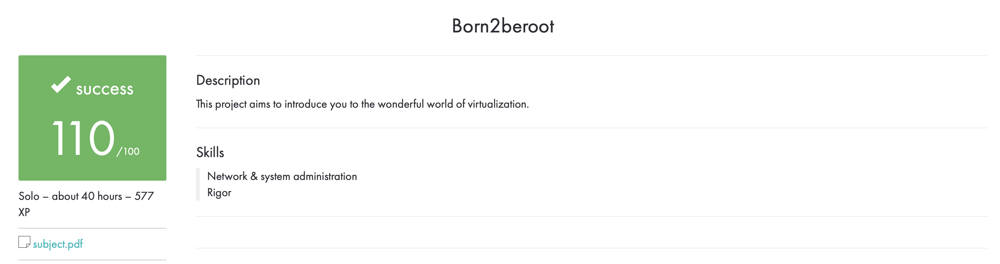

# Born2beroot

## Project Description

Born2beroot is a 42 school project that aims to introduce students to system administration. The goal is to set up a virtual machine using a Debian 10 operating system and configure it to meet certain security requirements.

## Requirements

- The virtual machine must use a Debian 10 operating system
- The root account must have a secure password
- SSH access must be limited to a specific user
- The system must have a firewall configured using UFW
- The system must have a web server installed and configured with SSL encryption
- The system must have a monitoring system installed and configured
